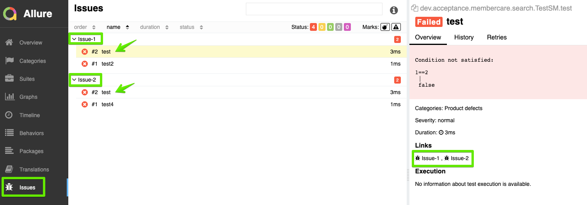

# ALLURE-KNOWN-ISSUES-TAB-PLUGIN

A custom plugin for [Allure reporting tool](https://docs.qameta.io/allure/). It gathers list of all tests which
have [@Issue annotation](https://docs.qameta.io/allure/#_links), groups them by issue ID and displays them on the new
custom tab `Issues`

This plugin can be used in any project utilizing Allure for reporting. To add it to your Allure distribution follow
instructions from [here](https://docs.qameta.io/allure/#_step_8_enabling_a_plugin)